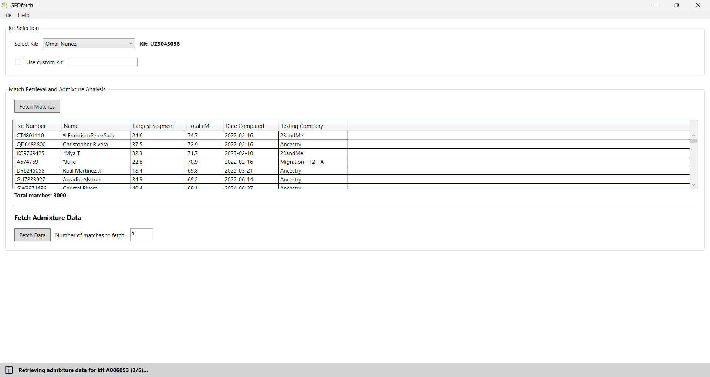

# GEDfetch

GEDfetch is a Windows desktop application that simplifies retrieving and exporting genetic match data from GEDmatch.

## Features

- Secure login to GEDmatch
- Kit selection from your GEDmatch account
- Automated fetching of one-to-many DNA matches with detailed information (kit number, name, segment data, etc.)
- Batch retrieval of Eurogenes K15 admixture analysis for selected matches
- Export results to CSV format with customizable filenames

## Installation

1. Download the latest GEDfetch from the [Releases](https://github.com/strike978/gedfetch/releases/) page.
2. Run the application.

## Usage

1. Launch the application.
2. The embedded browser will load GEDmatch login page. Log in with your credentials.
3. Once authenticated, select your DNA kit from the dropdown.
4. Click "Fetch Matches" to retrieve your one-to-many matches.
5. Select the number of matches to process for admixture data.
6. Click "Fetch Data" to retrieve Eurogenes K15 admixture results.
7. Choose a save location for the CSV file when prompted.

## Requirements

- Windows 10 or later
- Internet connection
- Valid GEDmatch account

## Disclaimer

This tool is for personal use only. Ensure you comply with GEDmatch's terms of service. The developers are not responsible for any misuse.
