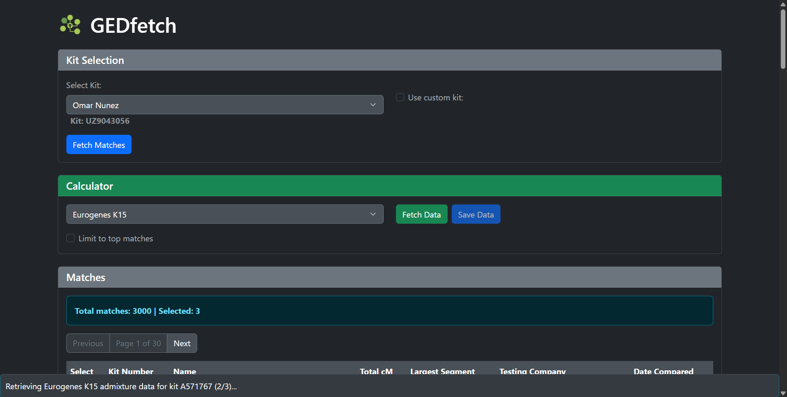

# GEDfetch

GEDfetch is a Windows desktop application that simplifies retrieving and exporting genetic match data from GEDmatch.

## Features

- Secure login to GEDmatch
- Kit selection from your GEDmatch account or manual entry of custom kit numbers
- Automated fetching of one-to-many DNA matches with detailed information (kit number, name, segment data, etc.)
- Batch retrieval of admixture analysis for selected matches using various calculators (Eurogenes K15, Eurogenes K13, etc.)
- Export results to CSV format with customizable filenames

## Installation

1. Download the latest GEDfetch from the [Releases](https://github.com/strike978/gedfetch/releases/) page.
2. Run the application.

## Usage

1. Launch the application.
2. The embedded browser will load GEDmatch login page. Log in with your credentials.
3. Once authenticated, select your DNA kit from the dropdown or check "Use custom kit" to enter a kit number manually.
4. Click "Fetch Matches" to retrieve your one-to-many matches.
5. Select the matches you want to process for admixture data by checking the boxes.
6. Choose an admixture calculator (e.g., Eurogenes K15 or Eurogenes K13) and click "Fetch Data" to retrieve admixture results.
7. Once processing is complete, click the "Save Data" button to export the results to a CSV file.

## Requirements

- Windows 10 or later
- Internet connection
- Valid GEDmatch account

## Disclaimer

This tool is for personal use only. Ensure you comply with GEDmatch's terms of service. The developers are not responsible for any misuse.
